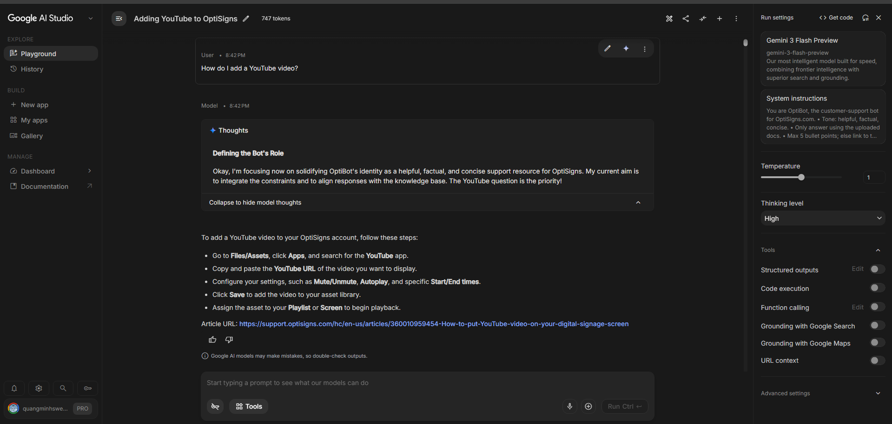

##Local Setup

### 1. Clone repo
git clone https://github.com/minhswe/minhswe-cr7-fifa-worldcup

cd minhswe-cr7-fifa-worldcup

### 2. Install dependencies
```shell
pip install -r requirements.txt
```
### 3. Configure environment

Create a `.env` file based on `.env.example`:

- `GEMINI_API_KEY`: API key for Gemini model access
- `BASE_URL`: Source website for scraping articles
- `FILE_SEARCH_STORE_NAME`: Vector store / knowledge base ID
- `GEMINI_MODEL`: Model name (e.g. gemini-1.5-flash)
- `MAX_ARTICLES`: Maximum number of articles to scrape
- `MAX_UPLOAD_FILES`: Limit for uploaded files per sync run

### 4. Run scraper + sync
```shell
python -m app.main
```

## Docker

### 1. Build image
```bash
docker build -t knowledge-sync .
```

### 2. Run
```shell
docker run --rm --env-file .env knowledge-sync
```
Notes:
- --rm: removes container after execution 
- --env-file: loads environment variables from .env 
- Container runs once and exits with status 0 if successful

## Screenshot

Question:
> "How do I add a YouTube video?"

Output:
- Step-by-step answer
- With cited article URLs



## Daily Sync Job

The system runs automatically every day via GitHub Actions:

🔗 GitHub Actions Logs:
https://github.com/minhswe/minhswe-cr7-fifa-worldcup/actions

## Vector Store Sync Strategy

During daily synchronization, documents are indexed using their **display name (article slug/title)** as the unique identifier.

When an article is detected as updated:
- The existing document in the vector store is first removed
- The updated Markdown version is then re-uploaded

This ensures the knowledge base always reflects the latest content without duplicate document versions.

## Vector Store Behavior (OpenAI vs Gemini)

This project handles vector storage behavior differences between providers:

### OpenAI-style vector stores
- Require explicit file re-upload for updates
- Do not automatically overwrite existing documents
- Document identity is managed externally (e.g. filename or metadata)

### Google Gemini / AI Studio approach
- May support different indexing semantics depending on implementation
- Can treat documents more dynamically depending on configuration

### My solution
To ensure consistency across providers:
- I enforce **manual delete + re-upload strategy**
- This guarantees no duplicate or stale documents exist in the knowledge base